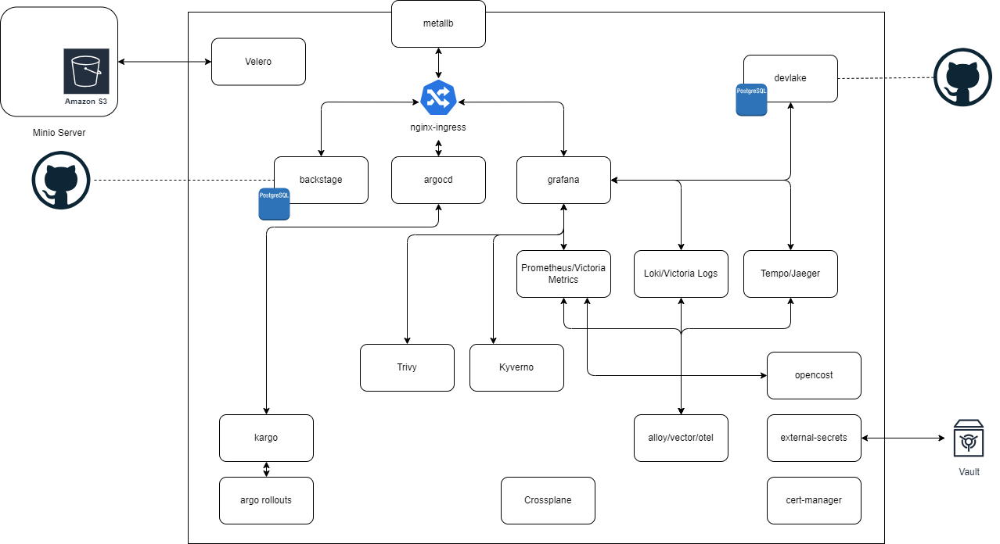
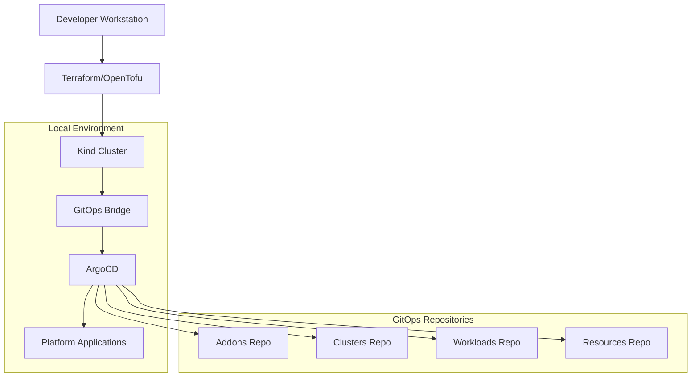

# DoKa Seca Architecture

## Overview

DoKa Seca is a comprehensive platform engineering framework designed around the "dry dock" concept - providing a controlled, isolated environment where complete cloud-native platforms can be rapidly assembled, configured, and tested. The architecture follows modern platform engineering principles with a strong emphasis on GitOps, Infrastructure as Code, and automated platform bootstrapping.

## Core Architecture Principles

### 1. **Dry Dock Pattern**

Just as ships are built and maintained in dry docks, DoKa Seca creates isolated local environments where entire Kubernetes platforms can be constructed with all necessary tooling and infrastructure readily available.

### 2. **GitOps-First Design**

All platform configuration, application deployments, and infrastructure changes are managed through Git repositories, ensuring reproducibility, auditability, and collaborative development.

### 3. **Opinionated Platform Stack**

Provides curated, production-ready components that work together seamlessly, reducing decision fatigue and accelerating time-to-productivity.

## High-Level Architecture

The DoKa Seca platform consists of several interconnected layers:

## Platform Components

### Infrastructure Layer

#### **Kind (Kubernetes in Docker)**

* **Purpose**: Provides the foundational Kubernetes runtime
* **Configuration**: Multi-node clusters with custom networking
* **Features**:
  * Port forwarding for local access
  * Custom image mounting
  * Ingress controller support
  * Load balancer simulation

#### **Terraform/OpenTofu**

* **Purpose**: Infrastructure as Code orchestration
* **Scope**: Cluster provisioning, GitOps bridge configuration, addon management
* **Workspaces**: Environment-specific configurations (dev, staging, prod)

### GitOps Layer

#### **GitOps Bridge**

* **Purpose**: Connects infrastructure provisioning with GitOps workflows
* **Function**: Injects cluster metadata and addon configurations into ArgoCD
* **Metadata**: Cluster information, addon enablement flags, repository references

#### **ArgoCD**

* **Purpose**: GitOps continuous delivery engine
* **Pattern**: App of Apps pattern for hierarchical application management
* **Features**:
  * Automated synchronization with Git repositories
  * Multi-repository support
  * Environment-specific application sets
  * Drift detection and remediation

### Application Layer

#### **Platform Applications**

The platform includes several categories of applications:

**Observability Stack**

* Victoria Metrics for monitoring and alerting
* Grafana for visualization
* Alloy for data collection
* Prometheus ecosystem compatibility

**Security & Compliance**

* Kyverno for policy enforcement
* Pod Security Standards
* Falco for runtime security
* Trivy for vulnerability scanning

**Developer Experience**

* Backstage for developer portal
* ArgoCD Image Updater for automated image updates
* Argo Rollouts for progressive delivery
* Argo Workflows for pipeline orchestration

**Platform Utilities**

* Reloader for automatic restarts
* Reflector for resource synchronization
* Cert-Manager for certificate management
* External Secrets Operator
