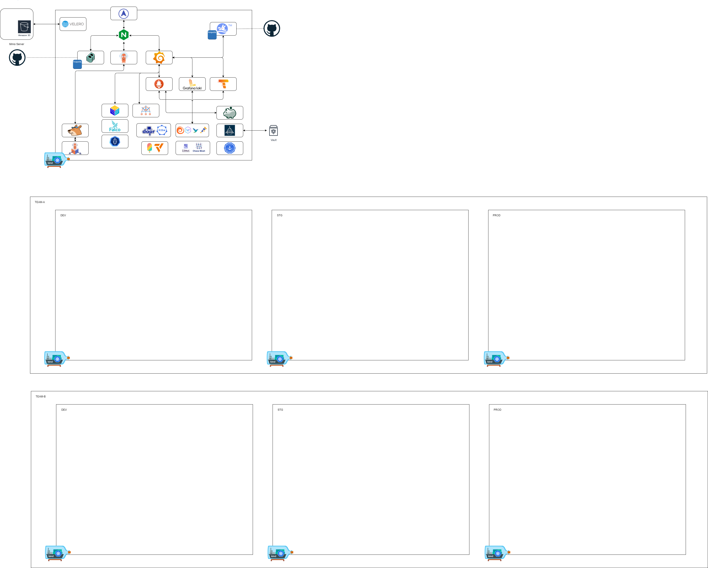

# DoKa Seca Architecture



## Overview

DoKa Seca is a comprehensive platform engineering framework designed around the "dry dock" concept - providing a controlled, isolated environment where complete cloud-native platforms can be rapidly assembled, configured, and tested. The architecture follows modern platform engineering principles with a strong emphasis on GitOps, Infrastructure as Code, and automated platform bootstrapping.

## Core Architecture Principles

### 1. **Dry Dock Pattern**

Just as ships are built and maintained in dry docks, DoKa Seca creates isolated local environments where entire Kubernetes platforms can be constructed with all necessary tooling and infrastructure readily available.

### 2. **GitOps-First Design**

All platform configuration, application deployments, and infrastructure changes are managed through Git repositories, ensuring reproducibility, auditability, and collaborative development.

### 3. **Opinionated Platform Stack**

Provides curated, production-ready components that work together seamlessly, reducing decision fatigue and accelerating time-to-productivity.

## High-Level Architecture

The DoKa Seca platform consists of several interconnected layers:


## Platform Components

### Infrastructure Layer

#### **Kind (Kubernetes in Docker)**

* **Purpose**: Provides the foundational Kubernetes runtime
* **Configuration**: Multi-node clusters with custom networking
* **Features**:
  * Port forwarding for local access
  * Custom image mounting
  * Ingress controller support
  * Load balancer simulation

#### **Terraform/OpenTofu**

* **Purpose**: Infrastructure as Code orchestration
* **Scope**: Cluster provisioning, GitOps bridge configuration, addon management
* **Workspaces**: Environment-specific configurations (dev, staging, prod)

### GitOps Layer

#### **GitOps Bridge**

* **Purpose**: Connects infrastructure provisioning with GitOps workflows
* **Function**: Injects cluster metadata and addon configurations into ArgoCD
* **Metadata**: Cluster information, addon enablement flags, repository references

#### **ArgoCD**

* **Purpose**: GitOps continuous delivery engine
* **Pattern**: App of Apps pattern for hierarchical application management
* **Features**:
  * Automated synchronization with Git repositories
  * Multi-repository support
  * Environment-specific application sets
  * Drift detection and remediation

### Application Layer

#### **Platform Applications**

The platform includes several categories of applications:

**Observability Stack**

* Victoria Metrics for monitoring and alerting
* Grafana for visualization
* Alloy for data collection
* Prometheus ecosystem compatibility

**Security & Compliance**

* Kyverno for policy enforcement
* Pod Security Standards
* Falco for runtime security
* Trivy for vulnerability scanning

**Developer Experience**

* Backstage for developer portal
* ArgoCD Image Updater for automated image updates
* Argo Rollouts for progressive delivery
* Argo Workflows for pipeline orchestration

**Platform Utilities**

* Reloader for automatic restarts
* Reflector for resource synchronization
* Cert-Manager for certificate management
* External Secrets Operator

## Repository Structure

DoKa Seca follows a multi-repository GitOps pattern:

### **Control Plane Repository** (This Repository)

```
dokaseca-control-plane/
├── terraform/           # Infrastructure as Code
├── charts/             # Helm charts for custom applications
├── gitops/             # GitOps configurations
├── docs/               # Documentation
└── scripts/            # Automation scripts
```

### **Addons Repository**

Contains ArgoCD ApplicationSets for platform addons:

```
dokaseca-addons/
├── appsets/            # ArgoCD ApplicationSets
├── charts/             # Addon-specific Helm charts
└── values/             # Environment-specific values
```

### **Clusters Repository**

Manages cluster-specific configurations:

```
dokaseca-clusters/
├── clusters/           # Per-cluster configurations
├── environments/       # Environment-specific settings
└── policies/           # Cluster policies
```

### **Workloads Repository**

Contains application workloads:

```
dokaseca-workloads/
├── applications/       # Application manifests
├── environments/       # Environment-specific configs
└── pipelines/          # CI/CD pipelines
```

## Data Flow

### 1. **Bootstrap Process**

```
Developer → terraform apply → Kind cluster creation → GitOps Bridge → ArgoCD installation → App of Apps deployment
```

### 2. **GitOps Sync Process**

```
Git commit → ArgoCD detection → Manifest retrieval → Kubernetes API → Resource creation/update
```

### 3. **Addon Management**

```
Terraform variables → GitOps Bridge metadata → ArgoCD cluster secret → ApplicationSet evaluation → Addon deployment
```

## Network Architecture

### **Local Development Setup**

* **Cluster Network**: Internal pod-to-pod communication
* **Host Integration**: Port forwarding for service access
* **Ingress**: Nginx ingress controller for HTTP/HTTPS routing
* **Service Mesh**: Optional Istio/Linkerd integration

### **Multi-Cluster Scenarios**

* **Cluster API**: For dynamic cluster provisioning
* **Cross-cluster Communication**: Service mesh federation
* **Centralized Management**: Hub-and-spoke model with ArgoCD

## Security Architecture

### **Supply Chain Security**

* Container image scanning with Trivy
* Image signing with Cosign
* Dependency vulnerability monitoring

### **Runtime Security**

* Pod Security Standards enforcement
* Falco for anomaly detection
* Network policies for traffic segmentation

### **Access Control**

* RBAC integration with ArgoCD
* External identity provider integration (Keycloak)
* Service account automation

## Scalability Patterns

### **Horizontal Scaling**

* Multi-cluster deployment support
* Team-based cluster isolation
* Environment promotion workflows

### **Vertical Scaling**

* Resource limit configuration
* Addon-specific resource allocation
* Monitoring-driven scaling decisions

## Operational Model

### **Day 1 Operations** (Initial Setup)

1. Infrastructure provisioning with Terraform
2. GitOps bridge configuration
3. Platform addon deployment
4. Initial application onboarding

### **Day 2 Operations** (Ongoing Management)

1. Application lifecycle management through GitOps
2. Platform addon updates via ArgoCD
3. Monitoring and alerting through observability stack
4. Security policy enforcement and compliance monitoring

### **Day N Operations** (Advanced Scenarios)

1. Multi-cluster federation
2. Disaster recovery procedures
3. Platform version upgrades
4. Custom addon development

## Configuration Management

### **Environment Strategy**

* **Development**: Full feature enablement for testing
* **Staging**: Production-like configuration for validation
* **Production**: Optimized, secure, and monitored deployment

### **Addon Configuration**

Addons are managed through Terraform variables:

```hcl
addons = {
  enable_argo_cd = true
  enable_victoria_metrics_k8s_stack = true
  enable_kyverno = true
  enable_backstage = false
}
```

### **Git Repository Configuration**

Repository references are configurable per environment:
```hcl
gitops_addons_repo = "dokaseca-addons"
gitops_addons_revision = "main"
gitops_workload_repo = "dokaseca-workloads"
gitops_workload_revision = "dev"
```

## Integration Points

### **External Systems**

* **GitHub**: Source code and GitOps repositories
* **Container Registries**: Image storage and distribution
* **Identity Providers**: Authentication and authorization
* **Monitoring Systems**: External observability integration

### **Development Workflow**

* **Local Development**: Kind-based development clusters
* **CI/CD Integration**: GitHub Actions for automation
* **Testing**: Automated testing with platform validation
* **Deployment**: GitOps-driven continuous delivery

This architecture enables DoKa Seca to provide a complete, production-ready platform engineering solution that can be rapidly deployed in local development environments while maintaining the patterns and practices used in production cloud-native platforms.
