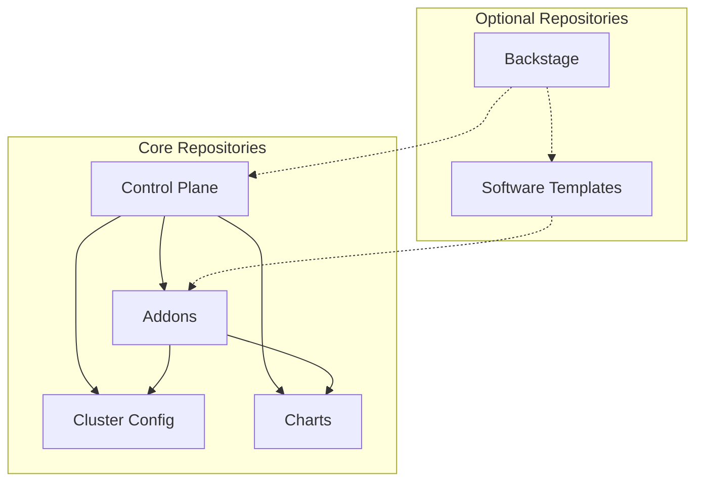

## Repository Structure

DoKa Seca follows a multi-repository GitOps pattern:

### **Control Plane Repository** (This Repository)

```sh
dokaseca-control-plane/
├── terraform/           # Infrastructure as Code
├── charts/             # Helm charts for custom applications
├── gitops/             # GitOps configurations
├── docs/               # Documentation
└── scripts/            # Automation scripts
```

### **Addons Repository**

Contains ArgoCD ApplicationSets for platform addons:

```sh
dokaseca-addons/
├── appsets/            # ArgoCD ApplicationSets
└── values/             # Environment-specific values
```

### **Clusters Repository**

Manages cluster-specific configurations:

```sh
dokaseca-clusters/
├── clusters/           # Per-cluster configurations
├── environments/       # Environment-specific settings
└── policies/           # Cluster policies
```

### **Workloads Repository**

Contains application workloads:

```sh
dokaseca-workloads/
├── applications/       # Application manifests
└── environments/       # Environment-specific configs
```

## Multi-Repository Architecture

DoKa Seca is designed as a distributed system composed of multiple specialized repositories, each serving a specific purpose
in the platform ecosystem. This approach provides clear separation of concerns, enables team autonomy, and supports scalable platform operations.

### Core Repositories

#### **1. Control Plane Repository** (`dokaseca-control-plane`)

**Purpose**: Central orchestration and infrastructure management

**Key Components**:

* **Terraform Modules**: Infrastructure as Code for cluster provisioning
* **GitOps Bridge**: Integration layer between infrastructure and applications
* **Documentation**: Comprehensive platform documentation
* **Scripts**: Automation tools and utilities

**Responsibilities**:

* Kubernetes cluster lifecycle management
* Platform infrastructure provisioning
* GitOps workflow orchestration
* Cross-repository coordination
* Platform documentation and guides

```text
dokaseca-control-plane/
├── terraform/
│   ├── modules/         # Reusable Terraform modules
│   ├── environments/    # Environment-specific configurations
│   └── providers.tf     # Cloud provider configurations
├── docs/               # Platform documentation
└── scripts/
    ├── bootstrap.sh    # Platform bootstrap script
    └── utils/          # Utility scripts
```

#### **2. Addons Repository** (`dokaseca-addons`)

**Purpose**: Platform addon management and configuration

**Key Components**:

- **ApplicationSets**: ArgoCD ApplicationSets for addon deployment
- **Value Templates**: Environment-specific addon configurations

**Responsibilities**:

- Platform addon lifecycle management
- Environment-specific addon configuration
- Addon dependency management
- Platform capability enablement

```text
dokaseca-addons/
├── appsets/
│   ├── observability/   # Monitoring and logging addons
│   ├── security/        # Security and compliance addons
│   ├── networking/      # Network and ingress addons
│   └── developer-tools/ # Developer experience addons
└── values/
    ├── dev/            # Development environment values
    ├── staging/        # Staging environment values
    └── production/     # Production environment values

```

#### **3. Helm Charts Repository** (`helm-charts`)

**Purpose**: Centralized Helm chart library and distribution

**Key Components**:

- **Application Charts**: Charts for common applications
- **Library Charts**: Reusable chart components and helpers
- **Chart Testing**: Automated chart validation and testing
- **Chart Registry**: Package distribution and versioning

**Responsibilities**:

- Helm chart development and maintenance
- Chart versioning and release management
- Chart testing and quality assurance
- Chart distribution and packaging


#### **4. Cluster Configuration Repository** (`dokaseca-clusters`)

**Purpose**: Cluster-specific configuration and policies

**Key Components**:

- **Cluster Manifests**: Per-cluster Kubernetes configurations
- **Environment Configs**: Environment-specific settings
- **Policy Definitions**: Cluster governance and security policies
- **Resource Quotas**: Cluster resource management

**Responsibilities**:

- Cluster-specific configuration management
- Environment isolation and configuration
- Cluster policy enforcement
- Resource allocation and quotas

```text
dokaseca-clusters/
├── clusters/
│   ├── dev-cluster/     # Development cluster config
│   ├── staging-cluster/ # Staging cluster config
│   └── prod-cluster/   # Production cluster config
├── environments/
│   ├── base/           # Base environment configuration
│   ├── overlays/       # Environment-specific overlays
│   └── secrets/        # Environment secret templates
└── rbac/
    ├── teams/            # Team-based RBAC
    └── service-accounts/ # Service account configurations
```

### Optional Repositories

#### **5. Backstage Setup Repository** (`dokaseca-backstage`) - Optional

**Purpose**: Developer portal configuration and customization

**Key Components**:

- **Backstage Configuration**: Developer portal setup
- **Custom Plugins**: Organization-specific Backstage plugins
- **Templates**: Software scaffolding templates
- **Catalog Definitions**: Service catalog configurations

**Responsibilities**:

- Developer portal deployment and configuration
- Custom plugin development and integration
- Service catalog management
- Developer experience customization

#### **6. Software Templates Repository** (`dokaseca-templates`) - Optional

**Purpose**: Software scaffolding and development templates

**Key Components**:

- **Application Templates**: Microservice and application templates
- **Infrastructure Templates**: Infrastructure scaffolding templates
- **Pipeline Templates**: CI/CD pipeline templates
- **Documentation Templates**: Project documentation templates

**Responsibilities**:

- Software project scaffolding
- Development best practices enforcement
- Standardized project structure
- Template lifecycle management

### Repository Relationships

#### **Inter-Repository Dependencies**



#### **Repository Access Patterns**

- **Control Plane** orchestrates and references all other repositories
- **Addons** consumes charts and applies cluster configurations
- **Cluster Config** provides environment-specific overrides
- **Charts** serves as a shared library for all repositories
- **Backstage** (optional) integrates with templates and platform repos
- **Software Templates** (optional) consumed by Backstage and development teams

### Configuration Strategy

#### **Repository Configuration Variables**

Each repository can be configured independently:

```hcl
# Control plane repository configuration
gitops_control_plane_repo = "https://github.com/org/dokaseca-control-plane"
gitops_control_plane_revision = "main"

# Addons repository configuration
gitops_addons_repo = "https://github.com/org/dokaseca-addons"
gitops_addons_revision = "v1.0.0"

# Charts repository configuration
gitops_charts_repo = "https://github.com/org/dokaseca-charts"
gitops_charts_revision = "main"

# Cluster configuration repository
gitops_clusters_repo = "https://github.com/org/dokaseca-clusters"
gitops_clusters_revision = "main"

# Optional: Backstage repository
gitops_backstage_repo = "https://github.com/org/dokaseca-backstage"
gitops_backstage_revision = "main"

# Optional: Software templates repository
gitops_templates_repo = "https://github.com/org/dokaseca-templates"
gitops_templates_revision = "main"
```

#### **Repository Branching Strategy**

- **main**: Production-ready configurations
- **develop**: Integration and testing branch
- **feature/***: Feature development branches
- **release/***: Release preparation branches
- **hotfix/***: Critical fixes for production

### Benefits of Multi-Repository Architecture

1. **Separation of Concerns**: Each repository has a clear, focused responsibility
2. **Team Autonomy**: Teams can work independently on their respective repositories
3. **Scalability**: Repositories can be scaled and managed independently
4. **Security**: Fine-grained access control per repository
5. **Versioning**: Independent versioning and release cycles
6. **Flexibility**: Optional repositories can be enabled based on organizational needs
7. **Reusability**: Charts and templates can be shared across multiple platform instances

## Data Flow

### 1. **Bootstrap Process**

```
Developer → terraform apply → Kind cluster creation → GitOps Bridge → ArgoCD installation → App of Apps deployment
```

### 2. **GitOps Sync Process**

```
Git commit → ArgoCD detection → Manifest retrieval → Kubernetes API → Resource creation/update
```

### 3. **Addon Management**

```
Terraform variables → GitOps Bridge metadata → ArgoCD cluster secret → ApplicationSet evaluation → Addon deployment
```

## Configuration Management

### **Environment Strategy**

* **Development**: Full feature enablement for testing
* **Staging**: Production-like configuration for validation
* **Production**: Optimized, secure, and monitored deployment

### **Addon Configuration**

Addons are managed through Terraform variables:

```hcl
addons = {
  enable_argo_cd = true
  enable_victoria_metrics_k8s_stack = true
  enable_kyverno = true
  enable_backstage = false
}
```

### **Git Repository Configuration**

Repository references are configurable per environment:

```hcl
gitops_addons_repo = "dokaseca-addons"
gitops_addons_revision = "main"
gitops_workload_repo = "dokaseca-workloads"
gitops_workload_revision = "dev"
```

## Integration Points

### **External Systems**

* **GitHub**: Source code and GitOps repositories
* **Container Registries**: Image storage and distribution
* **Identity Providers**: Authentication and authorization
* **Monitoring Systems**: External observability integration

### **Development Workflow**

* **Local Development**: Kind-based development clusters
* **CI/CD Integration**: GitHub Actions for automation
* **Testing**: Automated testing with platform validation
* **Deployment**: GitOps-driven continuous delivery
