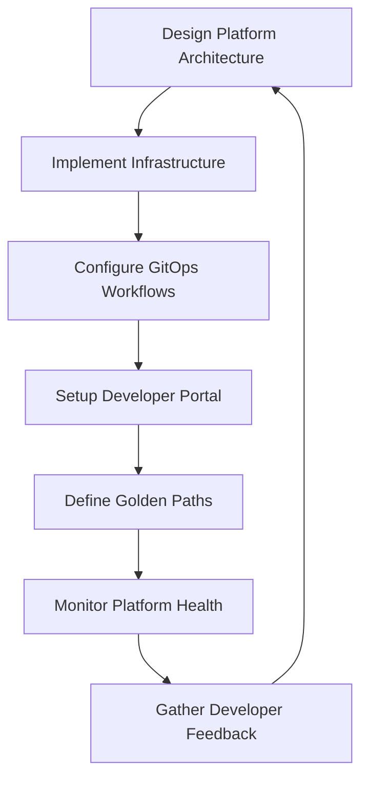
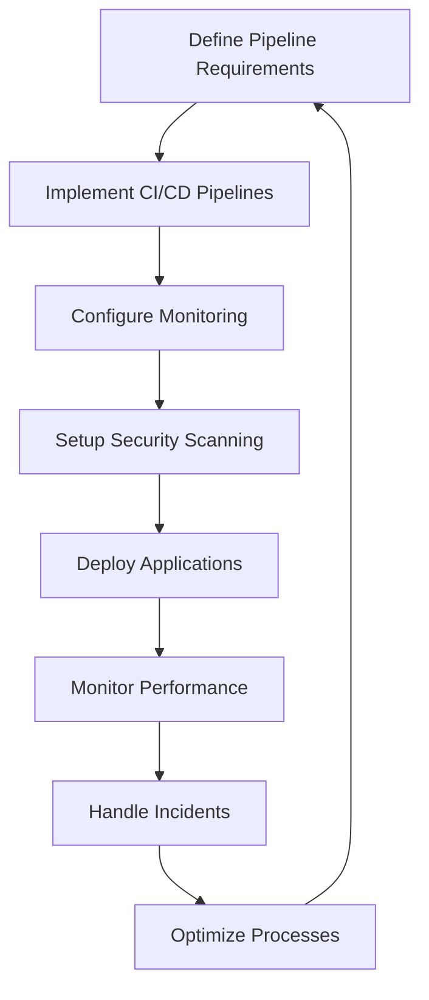
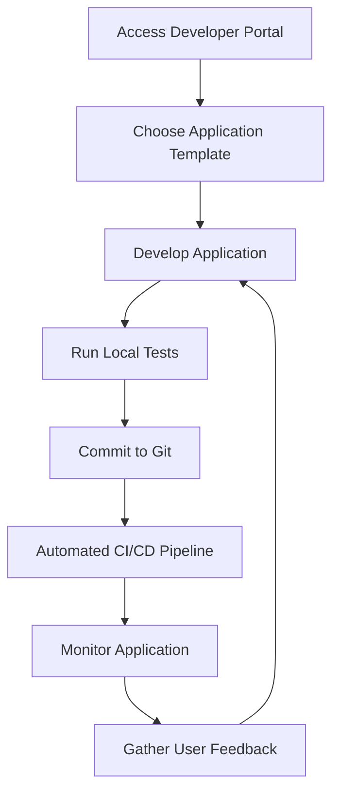

# Teams and Roles

## Overview

Modern platform engineering initiatives typically involve three core roles that work together to deliver and maintain cloud-native platforms:

- **Platform Engineers**: Design and build the platform infrastructure and developer experience
- **DevOps Engineers**: Bridge development and operations with automation and reliability practices
- **Developers**: Build and deploy applications using the platform's capabilities

Each role has distinct responsibilities, but successful platform engineering requires close collaboration and shared understanding of goals.

## Platform Engineer

Platform engineers are responsible for building and maintaining the underlying platform infrastructure that enables developer productivity and operational excellence.

### Platform Engineer Responsibilities

#### Infrastructure Design and Implementation

- Design platform architecture and technology stack decisions
- Implement Infrastructure as Code (IaC) using tools like Terraform and Crossplane
- Manage Kubernetes clusters and container orchestration
- Design and implement CI/CD pipelines and GitOps workflows
- Establish networking, security, and observability foundations

#### Developer Experience (DX)

- Build self-service capabilities and developer portals (e.g., Backstage)
- Create standardized templates and scaffolding tools
- Design APIs and abstractions that hide infrastructure complexity
- Implement golden paths for common development workflows
- Provide documentation and training materials

#### Platform Operations

- Monitor platform health and performance metrics
- Implement platform SLAs and reliability measures
- Manage platform upgrades and lifecycle management
- Establish backup and disaster recovery procedures
- Handle platform-level incident response and troubleshooting

#### Governance and Standards

- Define platform policies and compliance requirements
- Implement security controls and access management
- Establish cost optimization and resource management practices
- Create platform roadmaps and technical decision records
- Ensure platform scalability and maintainability

### DoKa Seca Platform Engineer Workflow

## DevOps Engineer

DevOps engineers focus on automating delivery pipelines, ensuring system reliability, and bridging the gap between development and operations teams.

Responsibilities

**Automation and Tooling**

- Build and maintain CI/CD pipelines for applications
- Implement automated testing and quality gates
- Create deployment automation and rollback procedures
- Develop infrastructure automation and configuration management
- Implement secrets management and security scanning

**Reliability Engineering**

- Design and implement monitoring and alerting systems
- Establish SLOs/SLIs for applications and services
- Implement chaos engineering and resilience testing
- Perform capacity planning and performance optimization
- Handle incident response and post-mortem processes

**Security and Compliance**

- Implement security scanning in pipelines
- Manage vulnerability assessments and remediation
- Ensure compliance with organizational policies
- Implement access controls and identity management
- Conduct security reviews and threat modeling

**Collaboration and Process**

- Work with developers to optimize deployment workflows
- Collaborate with platform engineers on infrastructure requirements
- Establish development and deployment best practices
- Provide training on DevOps tools and practices
- Participate in architecture and design reviews

### DoKa Seca DevOps Engineer Workflow

## Developer

Developers focus on building applications and services using the platform's capabilities, following established patterns and practices.

Responsibilities

**Application Development**

- Build applications using platform-provided templates and tools
- Follow established coding standards and best practices
- Implement application-level monitoring and logging
- Write comprehensive tests (unit, integration, e2e)
- Document application architecture and APIs

**Platform Adoption**

- Use platform self-service capabilities and developer portal
- Follow golden paths and established deployment patterns
- Leverage platform-provided services and abstractions
- Provide feedback on developer experience and tooling
- Participate in platform evolution discussions

**Operational Awareness**

- Understand application deployment and runtime characteristics
- Monitor application performance and user experience
- Participate in incident response for application issues
- Implement proper error handling and resilience patterns
- Consider security implications in application design

**Collaboration**

- Work with DevOps engineers on deployment strategies
- Collaborate with platform engineers on requirements
- Share knowledge and best practices with team members
- Participate in code reviews and technical discussions
- Contribute to platform documentation and examples

### DoKa Seca Developer Workflow

## Team Collaboration Patterns

**Platform Team Metrics**

- Platform uptime and reliability (99.9%+ SLA)
- Developer onboarding time (< 1 day)
- Self-service adoption rate (80%+)
- Mean time to recovery (MTTR) for platform issues

**Developer Team Metrics**

- Application deployment frequency
- Lead time from commit to production
- Application reliability and performance
- Developer satisfaction scores

## DoKa Seca Team Support

DoKa Seca provides tools and patterns to support effective team collaboration:

### For Platform Engineers

- **Crossplane compositions** for standardized infrastructure
- **ArgoCD applications** for GitOps workflows
- **Backstage catalog** for service discovery and documentation
- **Monitoring stack** with Prometheus, Grafana, and alerting

### For DevOps Engineers

- **CI/CD templates** with GitHub Actions
- **Security scanning** with Cosign and policy enforcement
- **Observability tools** for monitoring and troubleshooting
- **Infrastructure automation** with Terraform and Helm

### For Developers

- **Developer portal** with Backstage for self-service capabilities
- **Application templates** for quick project scaffolding
- **Golden paths** for common deployment patterns
- **Documentation** and examples for platform usage

## Best Practices

### Cross-Team Collaboration

1. **Establish Clear Interfaces**: Define APIs and contracts between teams
2. **Implement Feedback Loops**: Regular communication and feedback mechanisms
3. **Share Responsibility**: Platform and application teams share ownership of outcomes
4. **Invest in Documentation**: Comprehensive, up-to-date documentation for all stakeholders
5. **Measure and Improve**: Continuous measurement and improvement of team effectiveness

### Platform Adoption

1. **Start Small**: Begin with pilot projects and gradually expand
2. **Provide Training**: Invest in training and support for platform adoption
3. **Gather Feedback**: Continuously collect and act on user feedback
4. **Iterate Quickly**: Rapid iteration based on user needs and feedback
5. **Celebrate Success**: Recognize and celebrate platform adoption wins

The success of platform engineering initiatives depends on effective collaboration between these roles, clear
communication, and a shared commitment to improving developer productivity and operational excellence.
