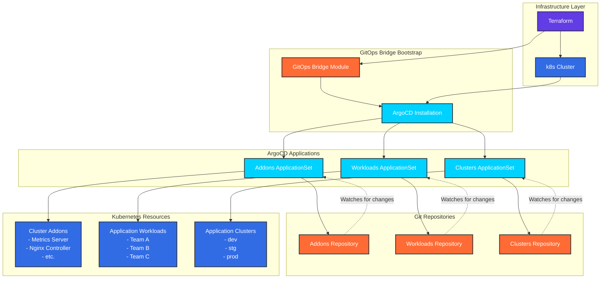
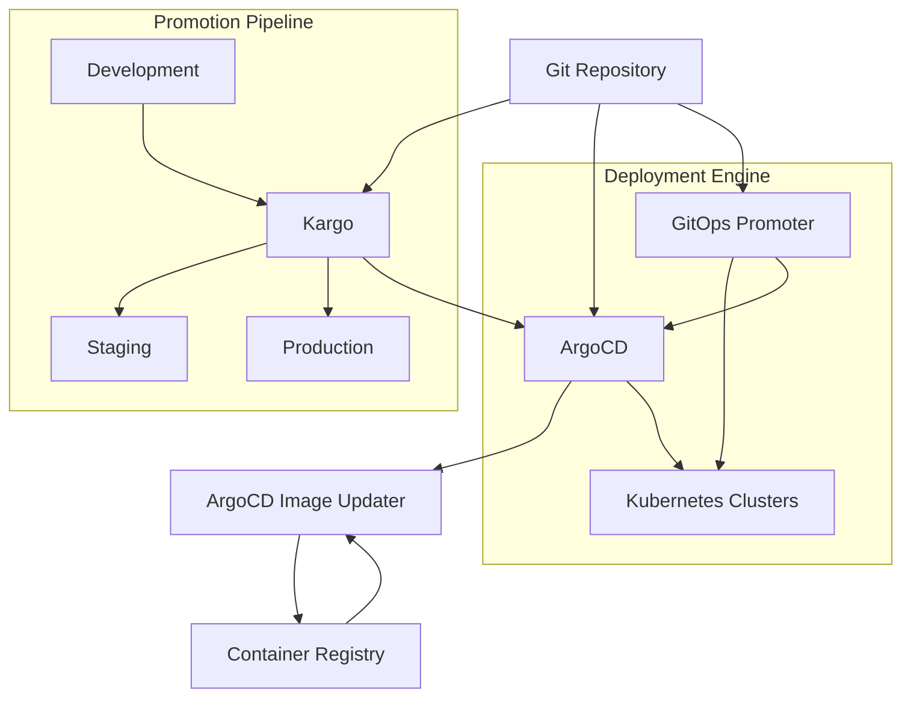

# GitOps

DoKa Seca implements a comprehensive GitOps strategy that provides automated deployment, promotion, and lifecycle management
for cloud-native applications. The platform integrates multiple GitOps tools to create a robust, scalable, and secure
deployment pipeline that follows GitOps principles and best practices.

## Overview

GitOps is a operational framework that takes DevOps best practices used for application development such as version control,
collaboration, compliance, and CI/CD, and applies them to infrastructure automation. DoKa Seca's GitOps implementation provides:

- **Declarative Infrastructure**: All infrastructure and application configurations stored in Git
- **Automated Deployments**: Continuous deployment based on Git repository changes
- **Progressive Delivery**: Sophisticated promotion workflows across environments
- **Security and Compliance**: Policy-driven deployments with audit trails
- **Observability**: Comprehensive monitoring and alerting for deployment pipelines

## GitOps Bridge Architecture

The GitOps Bridge is a key component that enables automated deployment and management of both cluster addons and workloads using ArgoCD.

Here's how it works:



### GitOps Bridge Workflow

1. **Bootstrap Phase**:
   - Terraform deploys the kubernetes cluster
   - GitOps Bridge module installs ArgoCD on the cluster
   - Creates initial ApplicationSets for addons and workloads

2. **Addons Management**:
   - `addons.yaml` ApplicationSet monitors the addons repository
   - Automatically deploys cluster-level components (metrics-server, Metallb, etc.)
   - Uses cluster annotations to determine which addons to deploy

3. **Workloads Management**:
   - `workloads.yaml` ApplicationSet monitors the workloads repository
   - Deploys application workloads (Team A, Team-b, Team-c)
   - Supports environment-specific configurations

3. **Clusters Management**:
   - `clusters.yaml` ApplicationSet monitors the clusters repository
   - Deploys application clusters (dev, stg, prod)

4. **Continuous Sync**:
   - ArgoCD continuously monitors Git repositories for changes
   - Automatically applies updates to the cluster
   - Provides drift detection and self-healing capabilities

## GitOps Architecture

DoKa Seca implements GitOps through a multi-tool approach that provides comprehensive coverage of the deployment lifecycle:



## Core GitOps Components for Team Workloads

### **ArgoCD - Continuous Deployment**

[ArgoCD](https://argo-cd.readthedocs.io/) serves as the primary GitOps continuous deployment tool in DoKa Seca:

#### ArgoCD Features

* **Application Deployment**: Declarative GitOps application management
* **Multi-Cluster Support**: Deploy to multiple Kubernetes clusters
* **RBAC Integration**: Role-based access control for teams
* **Sync Policies**: Automated and manual synchronization strategies
* **Health Monitoring**: Application health status and drift detection

#### ArgoCD Configuration Example

```yaml
apiVersion: argoproj.io/v1alpha1
kind: Application
metadata:
  name: web-application
  namespace: argocd
spec:
  project: default
  source:
    repoURL: https://github.com/org/dokaseca-workloads
    targetRevision: HEAD
    path: applications/web-app
  destination:
    server: https://kubernetes.default.svc
    namespace: production
  syncPolicy:
    automated:
      prune: true
      selfHeal: true
    syncOptions:
    - CreateNamespace=true
```

### **ArgoCD Image Updater - Automated Image Updates**

[ArgoCD Image Updater](https://argocd-image-updater.readthedocs.io/) automates container image updates in GitOps workflows:

#### Image Updater Features

* **Automatic Image Updates**: Monitor registries for new image versions
* **Semantic Versioning**: Intelligent version constraint handling
* **Git Integration**: Automated Git commits for image updates
* **Webhook Support**: Trigger updates via registry webhooks
* **Multi-Registry Support**: Works with various container registries

#### Image Updater Configuration Example

```yaml
apiVersion: argoproj.io/v1alpha1
kind: Application
metadata:
  name: api-service
  annotations:
    argocd-image-updater.argoproj.io/image-list: api=ghcr.io/org/api-service
    argocd-image-updater.argoproj.io/api.update-strategy: semver
    argocd-image-updater.argoproj.io/api.allow-tags: regexp:^v[0-9]+\.[0-9]+\.[0-9]+$
    argocd-image-updater.argoproj.io/api.ignore-tags: latest,main,develop
    argocd-image-updater.argoproj.io/write-back-method: git:secret:argocd/git-creds
spec:
  # ... application specification
```

### **Kargo - Progressive Delivery**

[Kargo](https://kargo.io/) provides sophisticated promotion workflows and progressive delivery capabilities:

#### Key Features

- **Multi-Stage Promotions**: Complex promotion pipelines across environments
- **Approval Workflows**: Human and automated approval gates
- **Rollback Capabilities**: Safe rollback to previous versions
- **Canary Deployments**: Gradual traffic shifting strategies
- **Integration Points**: Works with ArgoCD and other GitOps tools

#### Configuration Example

```yaml
apiVersion: kargo.akuity.io/v1alpha1
kind: Project
metadata:
  name: web-application
spec:
  promotionPolicies:
  - stage: staging
    autoPromotionEnabled: true
  - stage: production
    autoPromotionEnabled: false
---
apiVersion: kargo.akuity.io/v1alpha1
kind: Stage
metadata:
  name: production
  namespace: web-application
spec:
  subscriptions:
    upstreamStages:
    - name: staging
  promotionMechanisms:
    gitRepoUpdates:
    - repoURL: https://github.com/org/dokaseca-workloads
      writeBranch: main
      kustomize:
        images:
        - image: ghcr.io/org/web-app
          path: applications/web-app/production
```

### **GitOps Promoter - Environment Promotion**

[GitOps Promoter](https://github.com/argoproj-labs/gitops-promoter) handles automated promotion between environments:

#### Key Features

- **Environment Progression**: Automated promotion through environment stages
- **Policy-Based Promotion**: Promotion rules and constraints
- **Integration**: Works seamlessly with ArgoCD applications
- **Audit Trail**: Complete promotion history and rollback capabilities
- **Custom Promotion Logic**: Extensible promotion strategies

#### Configuration Example

```yaml
apiVersion: promoter.argoproj.io/v1alpha1
kind: PromotionStrategy
metadata:
  name: web-app-promotion
spec:
  environments:
  - name: development
    branch: main
    autoPromote: true
  - name: staging
    branch: staging
    autoPromote: true
    promotionPolicies:
    - name: health-check
      successCondition: "app.status.health.status == 'Healthy'"
  - name: production
    branch: production
    autoPromote: false
    approvalRequired: true
    promotionPolicies:
    - name: staging-success
      successCondition: "staging.status == 'Succeeded'"
    - name: security-scan
      successCondition: "securityScan.passed == true"
```

## DoKa Seca GitOps Implementation

### **Multi-Repository GitOps Structure**

DoKa Seca implements GitOps across multiple repositories for separation of concerns:

#### Control Plane Repository

- Platform infrastructure configurations
- ArgoCD application definitions
- Bootstrap configurations
- Cross-environment policies

#### Addons Repository

- Platform addon ApplicationSets
- Addon-specific configurations
- Environment-specific value overrides
- Addon promotion workflows

#### Workloads Repository

- Application deployment manifests
- Application-specific configurations
- Environment progression definitions
- Application promotion pipelines

#### Clusters Repository

- Cluster-specific configurations
- Environment definitions
- Resource quotas and limits
- Cluster policies and governance

### **GitOps Promotion Workflows**

DoKa Seca implements sophisticated promotion workflows using the integrated toolchain:

#### **Development to Staging Promotion**

1. **Image Update Detection**: ArgoCD Image Updater monitors for new images
2. **Automatic Deployment**: New images automatically deployed to development
3. **Health Validation**: Automated health checks and validation
4. **Kargo Promotion**: Automatic promotion to staging upon successful validation
5. **GitOps Promoter**: Updates staging environment configurations

#### **Staging to Production Promotion**

1. **Manual Approval**: Human approval required for production promotion
2. **Security Validation**: Additional security scans and compliance checks
3. **Kargo Orchestration**: Controlled promotion with rollback capabilities
4. **Progressive Deployment**: Canary or blue-green deployment strategies
5. **Monitoring Integration**: Continuous monitoring during promotion

### **Configuration Examples**

#### **ArgoCD ApplicationSet for Multi-Environment Deployment**

```yaml
apiVersion: argoproj.io/v1alpha1
kind: ApplicationSet
metadata:
  name: web-application-environments
  namespace: argocd
spec:
  generators:
  - clusters:
      selector:
        matchLabels:
          environment: web-app
  template:
    metadata:
      name: 'web-app-{{name}}'
      annotations:
        argocd-image-updater.argoproj.io/image-list: app=ghcr.io/org/web-app
        argocd-image-updater.argoproj.io/app.update-strategy: semver
        argocd-image-updater.argoproj.io/app.allow-tags: 'regexp:^v[0-9]+\.[0-9]+\.[0-9]+$'
    spec:
      project: default
      source:
        repoURL: https://github.com/org/dokaseca-workloads
        targetRevision: HEAD
        path: 'applications/web-app/{{metadata.labels.environment}}'
      destination:
        server: '{{server}}'
        namespace: web-app
      syncPolicy:
        automated:
          prune: true
          selfHeal: true
```

#### **Kargo Project Configuration**

```yaml
apiVersion: kargo.akuity.io/v1alpha1
kind: Project
metadata:
  name: platform-services
spec:
  promotionPolicies:
  - stage: development
    autoPromotionEnabled: true
  - stage: staging
    autoPromotionEnabled: true
    requirements:
    - healthChecks: true
    - securityScans: true
  - stage: production
    autoPromotionEnabled: false
    requirements:
    - manualApproval: true
    - stagingSuccess: true
    - complianceCheck: true
```

### **Integration with Platform Components**

#### **Observability Integration**

GitOps operations are fully integrated with DoKa Seca's observability stack:

- **Grafana Dashboards**: GitOps deployment metrics and trends
- **Prometheus Metrics**: ArgoCD, Kargo, and promotion metrics
- **Alert Manager**: Automated alerts for deployment failures
- **Victoria Metrics**: Long-term storage of GitOps metrics

#### **Security Integration**

GitOps workflows incorporate security best practices:

- **Kyverno Policies**: Policy validation for GitOps deployments
- **Cosign Verification**: Image signature verification
- **RBAC Controls**: Fine-grained access control for GitOps operations
- **Audit Logging**: Complete audit trail of all GitOps activities

#### **Compliance Integration**

Automated compliance checking throughout the GitOps pipeline:

- **Policy Validation**: Automated policy compliance checking
- **Security Scanning**: Container and configuration security scans
- **Approval Workflows**: Required approvals for sensitive environments
- **Documentation**: Automated documentation of promotion decisions

## Best Practices

### **Repository Management**

1. **Clear Structure**: Organize repositories with clear separation of concerns
2. **Branch Strategy**: Use appropriate branching strategies for environments
3. **Access Control**: Implement proper RBAC for repository access
4. **Backup Strategy**: Regular backups of Git repositories
5. **Documentation**: Maintain comprehensive GitOps documentation

### **Deployment Strategies**

1. **Progressive Delivery**: Use progressive deployment strategies
2. **Health Checks**: Implement comprehensive health validation
3. **Rollback Plans**: Maintain clear rollback procedures
4. **Monitoring**: Continuous monitoring during deployments
5. **Testing**: Automated testing at each stage

### **Security Practices**

1. **Image Scanning**: Automated vulnerability scanning
2. **Policy Enforcement**: Automated policy validation
3. **Secret Management**: Secure handling of sensitive data
4. **Access Logging**: Complete audit trails
5. **Approval Gates**: Required approvals for production

## Troubleshooting

### **Common Issues**

**Application Sync Failures**:

- Check Git repository accessibility
- Verify RBAC permissions
- Validate manifest syntax
- Review ArgoCD logs

**Image Update Failures**:

- Verify registry credentials
- Check image update annotations
- Review image updater logs
- Validate semantic versioning patterns

**Promotion Failures**:

- Check Kargo stage configurations
- Verify promotion policies
- Review approval requirements
- Validate target environment health

### **Monitoring and Alerting**

DoKa Seca provides comprehensive monitoring for GitOps operations:

```yaml
# Example Prometheus alert for GitOps failures
groups:
- name: gitops-alerts
  rules:
  - alert: ArgoCD Application Sync Failed
    expr: argocd_app_health_status{health_status!="Healthy"} == 1
    for: 5m
    labels:
      severity: warning
    annotations:
      summary: "ArgoCD application {{ $labels.name }} sync failed"
      description: "Application {{ $labels.name }} has been unhealthy for more than 5 minutes"

  - alert: Image Update Failed
    expr: increase(argocd_image_updater_images_updated_errors_total[5m]) > 0
    labels:
      severity: warning
    annotations:
      summary: "Image updater failed to update images"
      description: "ArgoCD Image Updater has failed to update images"
```
