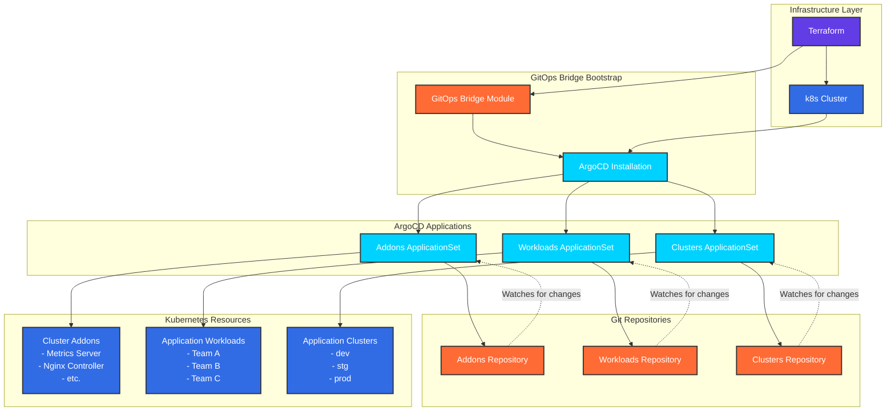

# GitOps

DoKa Seca implements a comprehensive GitOps strategy that provides automated deployment, promotion, and lifecycle management
for cloud-native applications. The platform integrates multiple GitOps tools to create a robust, scalable, and secure
deployment pipeline that follows GitOps principles and best practices.

## Introduction

GitOps is a operational framework that takes DevOps best practices used for application development such as version control,
collaboration, compliance, and CI/CD, and applies them to infrastructure automation.

DoKa Seca's GitOps implementation provides:

* **Declarative Infrastructure**: All infrastructure and application configurations stored in Git
* **Automated Deployments**: Continuous deployment based on Git repository changes
* **Progressive Delivery**: Sophisticated promotion workflows across environments
* **Security and Compliance**: Policy-driven deployments with audit trails
* **Observability**: Comprehensive monitoring and alerting for deployment pipelines

## GitOps Bridge Architecture

The GitOps Bridge is a key component that enables automated deployment and management of both cluster addons and workloads using ArgoCD.

Here's how it works:

### GitOps Bridge Workflow

1. Bootstrap Phase
    * Terraform deploys the Kubernetes cluster
    * GitOps Bridge module installs ArgoCD on the cluster
    * Creates initial ApplicationSets for addons and workloads

2. Addons Management
    * `addons.yaml` ApplicationSet monitors the addons repository
    * Automatically deploys cluster-level components (metrics-server, Metallb, etc.)
    * Uses cluster annotations to determine which addons to deploy

3. Workloads Management
    * `workloads.yaml` ApplicationSet monitors the workloads repository
    * Deploys application workloads (Team A, Team-b, Team-c)
    * Supports environment-specific configurations

4. Clusters Management
    * `clusters.yaml` ApplicationSet monitors the clusters repository
    * Deploys application clusters (dev, stg, prod)

5. Continuous Sync
    * ArgoCD continuously monitors Git repositories for changes
    * Automatically applies updates to the cluster
    * Provides drift detection and self-healing capabilities
