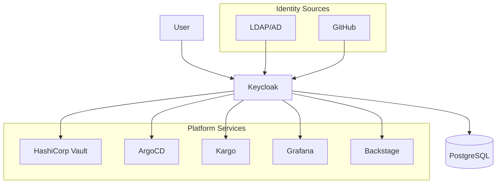

# Identity and Access Management

This document describes the identity and access management (IAM) setup for the DoKa Seca platform, including Keycloak integration with various platform components.

## Overview

The DoKa Seca platform uses Keycloak as the central identity provider (IdP) to provide:

- **Single Sign-On (SSO)** across all platform components
- **Multi-tenant user management** with role-based access control
- **OIDC/SAML integration** with platform services
- **Identity federation** with external providers
- **Audit logging** for compliance requirements

## Architecture



## Authentication

### Keycloak Setup

Keycloak serves as the central identity provider with the following configuration:

- **Database**: PostgreSQL for persistent storage
- **Realm**: `dokaseca` - main realm for all platform users
- **Protocols**: OIDC/OAuth2 and SAML 2.0 support
- **Federation**: Integration with external identity providers

### Getting Started

**Access admin console**: <http://localhost:8080>

- Username: `admin`
- Password: `admin_password`

## Authorization

### User Roles

| Role             | Description              | Permissions                                               |
|------------------|--------------------------|-----------------------------------------------------------|
| `platform-admin` | Platform administrators  | Full access to all platform components and infrastructure |
| `tenant-admin`   | Tenant administrators    | Administrative access within their tenant namespace       |
| `developer`      | Development team members | Read/write access to tenant applications and resources    |
| `viewer`         | Read-only users          | View-only access to tenant resources and dashboards       |

### Groups and Multi-Tenancy

Groups provide the primary mechanism for multi-tenancy:

- **`platform-team`**: Platform engineering team with `platform-admin` role
- **`tenant-a`**: Tenant A team members with `tenant-admin` and `developer` roles
- **`tenant-b`**: Tenant B team members with `tenant-admin` and `developer` roles
- **`tenant-c`**: Tenant C team members with `tenant-admin` and `developer` roles

## Service Integration

### HashiCorp Vault

Vault integrates with Keycloak using the OIDC auth method:

```bash
# Enable OIDC auth method
vault auth enable oidc

# Configure OIDC
vault write auth/oidc/config \
    oidc_discovery_url="https://keycloak.dokaseca.local/realms/dokaseca" \
    oidc_client_id="vault" \
    oidc_client_secret="vault-client-secret" \
    default_role="default"
```

### ArgoCD

ArgoCD integrates with Keycloak for SSO and RBAC:

```yaml
oidc.config: |
  name: Keycloak
  issuer: https://keycloak.dokaseca.local/realms/dokaseca
  clientId: argocd
  clientSecret: argocd-client-secret
  requestedScopes: ["openid", "profile", "email", "groups"]

policy.csv: |
  p, role:platform-admin, applications, *, */*, allow
  p, role:platform-admin, clusters, *, *, allow
  g, platform-team, role:platform-admin
```

## Security Configuration

### Password Policies

- Minimum 12 characters
- Mixed case letters, numbers, and special characters
- Username/email restrictions
- Brute force protection enabled

### Session Management

- SSO session timeout: 30 minutes
- Maximum session lifespan: 10 hours
- Access token lifespan: 5 minutes
- Offline session timeout: 30 days

## Federation and External Providers

### GitHub Integration

Configure GitHub as an identity provider for developer authentication:

```json
{
  "providerId": "github",
  "alias": "github",
  "displayName": "GitHub",
  "config": {
    "clientId": "${github.client.id}",
    "clientSecret": "${github.client.secret}",
    "defaultScope": "user:email"
  }
}
```

### LDAP/Active Directory

Enterprise LDAP integration for corporate users:

```json
{
  "providerId": "ldap",
  "alias": "ldap",
  "displayName": "Corporate LDAP",
  "config": {
    "vendor": "ad",
    "connectionUrl": "ldaps://ldap.company.com:636",
    "usersDn": "ou=users,dc=company,dc=com"
  }
}
```

## References

- [Keycloak Documentation](https://www.keycloak.org/documentation)
- [OIDC Specification](https://openid.net/connect/)
- [OAuth 2.0 Security Best Practices](https://tools.ietf.org/html/draft-ietf-oauth-security-topics)
- [Vault OIDC Auth Method](https://www.vaultproject.io/docs/auth/oidc)
