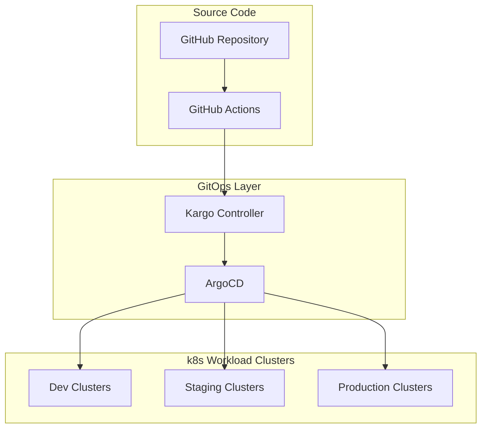

# RFC 0001: GitOps Promotion with Kargo

**Title:** RFC 0001: GitOps Promotion with Kargo  
**Author(s):** DoKa Seca Team  
**Date:** 2025-08-14  
**Status:** Draft

## Context and Problem Statement

DoKa Seca currently lacks a mature, production-ready GitOps promotion solution that can handle complex workload deployments across multiple environments with proper observability and approval workflows.

## Summary

This RFC proposes adopting Kargo as the primary GitOps promotion tool for DoKa Seca's workload deployment pipeline. Kargo will facilitate automated, progressive delivery of applications across environments (`dev → staging → production`) while maintaining GitOps best practices and providing superior observability compared to alternative solutions.

## Motivation

DoKa Seca currently supports multiple GitOps promotion strategies including ArgoCD Image Updater with GitOps Promoter. However, these solutions have limitations:

- **ArgoCD Image Updater**: Limited to image updates only, lacks comprehensive promotion workflows, and provides minimal visibility into the promotion process
- **GitOps Promoter**: Still in early development, not mature enough for production use, and has limited community adoption

Modern cloud-native platforms require sophisticated promotion workflows that can handle complex deployment scenarios, and integrate seamlessly with existing GitOps tooling. Kargo addresses these needs by offering:

1. **Comprehensive Promotion Workflows**: Beyond just image updates, supports Git-based promotions, configuration changes, and complex multi-step workflows
2. **Production Readiness**: Mature project with strong community backing and proven enterprise adoption
3. **Enhanced Observability**: Built-in dashboards and detailed promotion history
4. **GitOps Native**: Designed specifically for GitOps workflows, not retrofitted

## Detailed Design

### Overview

Kargo will serve as the orchestration layer for promoting workloads through DoKa Seca's standard environment progression: `dev → staging → production`.
It integrates with ArgoCD applications to trigger deployments while maintaining full GitOps principles.

### Technical Specification

#### Architecture Integration



#### Configuration Changes

1. **Terraform Integration**
   - Enable Kargo addon in `terraform/locals.tf`:

   ```hcl
   enable_kargo = try(var.addons.enable_kargo, true)  # in hub cluster
   ```

2. **Promotion Pipeline Definition**

   ```yaml
   apiVersion: kargo.akuity.io/v1alpha1
   kind: Project
   metadata:
     name: dokaseca-workloads
   ---
   apiVersion: kargo.akuity.io/v1alpha1
   kind: Stage
   metadata:
     name: dev
   spec:
     requestedFreight:
     - origin:
         kind: Warehouse
         name: my-warehouse
       sources:
         direct: true
     promotionMechanisms:
       gitRepoUpdates:
       - repoURL: https://github.com/your-org/manifests
         writeBranch: main
         kustomize:
           images:
           - image: ghcr.io/your-org/my-app
             path: envs/dev
   ```

### Examples

#### Basic Promotion Workflow

```yaml
## Warehouse - Detects New Container Images
apiVersion: kargo.akuity.io/v1alpha1
kind: Warehouse
metadata:
  name: my-app-warehouse
spec:
  subscriptions:
  - image:
      repoURL: ghcr.io/dokaseca/my-app
      tagSelectionStrategy:
        semVer:
          allowPrerelease: false

---
## Development Stage
apiVersion: kargo.akuity.io/v1alpha1
kind: Stage
metadata:
  name: dev
spec:
  requestedFreight:
  - origin:
      kind: Warehouse
      name: my-app-warehouse
    sources:
      direct: true
  promotionMechanisms:
    gitRepoUpdates:
    - repoURL: https://github.com/dokaseca/manifests
      writeBranch: main
      kustomize:
        images:
        - image: ghcr.io/dokaseca/my-app
          path: apps/my-app/envs/dev
```

#### Advanced Multi-Environment Promotion

```yaml
## Staging Stage Configuration
apiVersion: kargo.akuity.io/v1alpha1
kind: Stage
metadata:
  name: staging
spec:
  requestedFreight:
  - origin:
      kind: Stage
      name: dev
    sources:
      stages:
      - dev
  verification:
    analysisTemplates:
    - name: dev-health-check
  promotionMechanisms:
    gitRepoUpdates:
    - repoURL: https://github.com/dokaseca/manifests
      writeBranch: main
      kustomize:
        images:
        - image: ghcr.io/dokaseca/my-app
          path: apps/my-app/envs/staging

---
## Production Stage - Requires Approval
apiVersion: kargo.akuity.io/v1alpha1
kind: Stage
metadata:
  name: production
spec:
  requestedFreight:
  - origin:
      kind: Stage
      name: staging
    sources:
      stages:
      - staging
  promotionPolicy:
    autoPromotionEnabled: false  # Requires manual approval
  promotionMechanisms:
    gitRepoUpdates:
    - repoURL: https://github.com/dokaseca/manifests
      writeBranch: main
      kustomize:
        images:
        - image: ghcr.io/dokaseca/my-app
          path: apps/my-app/envs/production
```

## Dependencies

- **ArgoCD**: Kargo integrates with ArgoCD applications for deployment execution
- **Cert-Manager**: Required for Kargo's webhook certificates
- **Argo Rollouts**: Needed for advanced deployment strategies
- **Git Repository Access**: Kargo needs write access to manifest repositories
- **Container Registry Access**: For monitoring new image releases

## Alternatives Considered

### ArgoCD Image Updater

**Pros:**

- Already integrated with DoKa Seca
- Minimal additional infrastructure
- Direct ArgoCD integration

**Cons:**

- Limited to image updates only
- Poor observability and audit trail
- No support for complex promotion workflows
- Lacks approval mechanisms for production deployments

**Rejected because**: Too limited for comprehensive GitOps promotion needs.

### GitOps Promoter

**Pros:**

- Lightweight design
- Simple promotion concepts
- Kubernetes-native

**Cons:**

- Very early stage project
- Limited community adoption
- Sparse documentation
- Unclear long-term roadmap
- Not production-ready

**Rejected because**: Insufficient maturity for production deployments.

### Manual Promotion with Scripts

**Pros:**

- Full control over promotion logic
- No additional dependencies
- Custom integration possibilities

**Cons:**

- High maintenance overhead
- No standardized workflows
- Limited observability
- Error-prone manual processes

**Rejected because**: Does not scale and contradicts GitOps automation principles.

## Considered Options

1. **Kargo** - Comprehensive GitOps promotion platform (Recommended)
2. **ArgoCD Image Updater** - Basic image update automation
3. **GitOps Promoter** - Early-stage promotion tool
4. **Manual Promotion with Scripts** - Custom scripted approach

## Decision Outcome

**Chosen option: Kargo** - Provides the most comprehensive solution for GitOps promotion with production-ready maturity, excellent observability, and flexible workflow capabilities that align with DoKa Seca's architectural goals.

## Risks and Mitigation

- **Risk 1: Complexity increase** - *Mitigation:* Provide comprehensive documentation, examples, and training materials. Start with simple use cases and gradually adopt advanced features.

- **Risk 2: Learning curve for operators** - *Mitigation:* Incremental rollout with pilot projects. Extensive documentation and examples. Training sessions for platform team.

- **Risk 3: Resource overhead** - *Mitigation:* Resource monitoring and optimization. Right-sizing based on actual usage patterns.

## Impact Assessment

### Breaking Changes

- Applications using automatic image updates will require new Kargo stage definitions
- CI/CD pipelines may need updates to trigger Kargo promotions instead of direct image updates

### Performance Impact

- **Positive**: More efficient promotion workflows with better batching and scheduling
- **Neutral**: Minimal additional resource consumption

### Security Considerations

- Kargo requires Git repository write access
- Use dedicated service accounts with minimal required permissions
- Audit trail improvements through Kargo's built-in promotion history

## Open Questions

- What approval mechanisms should be implemented for production promotions?
- How should we handle applications that require non-standard promotion workflows?
- Should Kargo promotion policies be centrally managed or distributed per application team?

## References

- [Kargo Official Documentation](https://docs.kargo.io/)
- [Kargo GitHub Repository](https://github.com/akuity/kargo)
- [ArgoCD Image Updater Documentation](https://argocd-image-updater.readthedocs.io/)
- [GitOps Promoter GitHub](https://github.com/argoproj-labs/gitops-promoter)
- [DoKa Seca GitOps Architecture](../getting_started/architecture.md)
