# RFC Process for DoKa Seca

## Overview

The Request for Comments (RFC) process is a collaborative method for proposing, discussing, and documenting significant
changes to the DoKa Seca platform.
RFCs help ensure that important decisions are well-reasoned, communicated effectively, and aligned with the project's goals.

## When to Write an RFC

Consider writing an RFC for changes that:

- **Introduce new major features** or components to the platform
- **Modify core architecture** or fundamental design patterns
- **Change established workflows** or user interfaces significantly
- **Affect multiple components** or require cross-team coordination
- **Have significant performance, security, or operational implications**
- **Require community input** or may be controversial

### Examples of RFC-Worthy Changes

- Adding support for a new Kubernetes distribution (e.g., k0s, k3d)
- Implementing a new GitOps workflow or changing the current ArgoCD/FluxCD approach
- Introducing new cluster management patterns or topologies
- Major changes to the Terraform infrastructure provisioning
- Adding new observability or security frameworks
- Significant changes to the addon management system

## RFC Lifecycle

1. Draft Phase: Author creates initial RFC document.
2. Review Phase:  RFC is submitted as a Pull Request. Author updates RFC based on feedback to find issues or improvements (minimum 1 week).
3. Decision Phase:  RFC is either **Accepted**, **Rejected**, or **Postponed**. The decision is documented with rationale. If accepted, implementation timeline is established
4. Implementation Phase: Implementation proceeds according to RFC specifications. RFC status updated to **Implemented** upon completion.

## RFC Lifecycle Diagram

The following diagram illustrates the complete RFC lifecycle and its integration with Architecture Decision Records (ADRs):

```mermaid
flowchart TD
    A["💡 Idea/Problem Identified"] --> B{"RFC Needed?"}
    B -->|No| C[" Direct Implementation"]
    B -->|Yes| D["📝 Draft RFC"]

    D --> H["🔄 Submit Pull Request"]

    H --> M["🏛️ Decision"]
    M -->|Rejected| O["❌ RFC Rejected"]
    M -->|Postponed| P["⏸️ RFC Postponed"]
    M -->|Accepted| Q["✅ RFC Accepted"]

    O --> O1["📚 Archive for Reference"]
    P --> P1["🔄 May Resume Later"]
    P1 --> D

    Q --> R["🔨 Implementation"]
    R --> U{"Implementation<br/>Complete?"}
    U -->|Yes| V["✅ Mark RFC as Implemented<br/>🎉 RFC Complete"]
    V --> X["🖊️ Create ADR"]


    %% Styling
    classDef rfc fill:#e1f5fe,stroke:#0277bd,stroke-width:2px
    classDef adr fill:#f3e5f5,stroke:#7b1fa2,stroke-width:2px
    classDef decision fill:#fff3e0,stroke:#ef6c00,stroke-width:2px
    classDef implementation fill:#e8f5e8,stroke:#2e7d32,stroke-width:2px
    classDef archive fill:#fce4ec,stroke:#c2185b,stroke-width:2px

    class D,H,Q,V rfc
    class X adr
    class M,N,B,U,X decision
    class W,R implementation
    class O,O1,P,P1,DD archive
```



### When do we use ADRs? When do we use RFCs?

- RFCs cover high-level proposals, while ADRs document specific technical decisions.
- Write an RFC if the change affects other teams, has a significant impact, or requires broad input.
- Write an ADR if the change is localized to a specific component or implementation detail.

You collected feedback on an RFC and decided to move forward with the proposed changes. Write an ADR to capture the specific architectural decisions made during implementation.

## RFC Template

Create your RFC using the following template:

```markdown
# RFC {number}: {Title}

**Author(s):** {Name(s)}  
**Date:** {YYYY-MM-DD}  
**Status:** {Draft | Under Review | Accepted | Rejected | Postponed | Implemented}

## Summary

Brief one-paragraph summary of the proposal.

## Motivation

What problem does this solve? Why is this change necessary?

## Detailed Design

### Overview

High-level description of the proposed solution.

### Technical Specification

Detailed technical implementation including:

- Architecture changes
- API modifications
- Configuration changes
- Migration strategies

### Examples

Code examples, configuration snippets, or usage scenarios.

## Implementation Plan

### Timeline

- Phase 1: {Description and timeline}
- Phase 2: {Description and timeline}
- Phase N: {Description and timeline}

### Dependencies

- Required changes to other components
- External dependencies or prerequisites

### Testing Strategy

How will this change be tested and validated?

## Alternatives Considered

What other approaches were considered and why were they rejected?

## Risks and Mitigation

- **Risk 1:** {Description} - *Mitigation:* {Strategy}
- **Risk 2:** {Description} - *Mitigation:* {Strategy}

## Impact Assessment

### Breaking Changes

- Changes that affect existing users
- Migration requirements

### Performance Impact

- Expected performance implications
- Resource usage changes

### Security Considerations

- Security implications of the change
- New attack vectors or mitigations

## Open Questions

- Question 1?
- Question 2?

## References

- Related issues, ADRs, or external documentation
- Prior art or similar implementations
```

## Writing Guidelines

### Content Quality

- **Be clear and concise:** Use simple language and avoid jargon when possible
- **Include examples:** Provide concrete examples and use cases
- **Consider edge cases:** Think through potential corner cases and failure modes
- **Document trade-offs:** Explain why certain decisions were made over alternatives

### Technical Details

- **Specify interfaces:** Define APIs, configuration formats, and integration points
- **Include diagrams:** Use ASCII art, Mermaid, or other text-based diagrams
- **Show migration paths:** Explain how existing systems will transition
- **Address backward compatibility:** Detail any breaking changes and mitigation strategies

### Formatting

- Follow Markdown best practices
- Break lines at 120 characters for readability
- Use proper heading hierarchy
- Include code blocks with syntax highlighting

## RFC Review Process

### Submission

1. **Create a new branch** following the pattern `rfc/NNNN-short-title`
2. **Create RFC file** in `docs/rfc/` using format `NNNN-title.md`
3. **Submit Pull Request** with RFC label
4. **Update RFC index** to include the new RFC

### Review Criteria

Reviewers should evaluate:

- **Problem clarity:** Is the motivation well-defined?
- **Solution appropriateness:** Does the solution fit the problem?
- **Technical soundness:** Is the design technically feasible?
- **Implementation feasibility:** Can this realistically be implemented?
- **Impact assessment:** Are risks and benefits well understood?
- **Alignment:** Does this fit with DoKa Seca's goals and architecture?

### Decision Making

- RFCs require approval from at least 2 core maintainers
- Major architectural changes may require broader consensus
- Decisions are documented in the RFC with clear rationale
- Rejected RFCs remain in the repository for historical reference

## Examples and References

### Existing RFCs

- [RFC 0001: GitOps Promotion with Kargo](0001-gitops-promotion-with-kargo.md)

### External References

- [Rust RFC Process](https://github.com/rust-lang/rfcs)
- [Kubernetes Enhancement Proposals](https://github.com/kubernetes/enhancements)
- [When should I write an Architecture Decision Record?](https://engineering.atspotify.com/2020/04/when-should-i-write-an-architecture-decision-record)
- [Driving Architectural Decisions with ADRs](https://newsletter.techworld-with-milan.com/p/driving-architectural-decisions-with)

---

**Questions or suggestions about the RFC process?** Open an issue or start a discussion!
