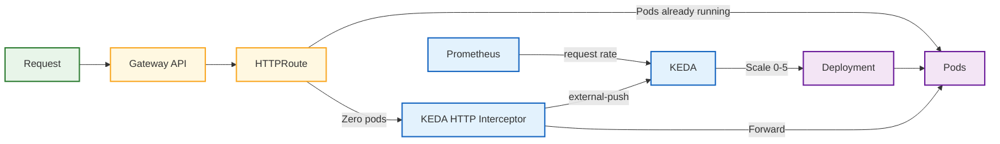

# Scaling

## Overview

Scaling runbooks provide a structured approach to managing the growth of this platform.
They outline the steps to take when scaling up or down, helping users quickly identify the resources needed to accommodate changes in demand while maintaining performance and reliability.

## Autoscaling Support

Doka Seca supports application autoscaling patterns built on Kubernetes-native primitives and event-driven scaling.
For request-driven workloads, it supports [KEDA](https://keda.sh/) together with [keda-add-ons-http](https://github.com/kedacore/http-add-on), allowing Kubernetes users to automatically scale their HTTP servers up and down based on incoming HTTP traffic.

This includes scale-to-zero and scale-from-zero behavior for HTTP applications, which is useful for:

- Internal developer portals
- APIs with bursty or intermittent traffic
- Preview environments
- Cost-sensitive platform services that do not need to run continuously

## KEDA for HTTP Workloads

When KEDA HTTP scaling is enabled, incoming requests are routed through the HTTP add-on interceptor.
That component measures pending HTTP traffic and triggers scaling decisions for the target workload.
This lets a Deployment remain at zero replicas when idle and automatically scale up when traffic arrives.

### Request Flow Diagram

The following diagram summarizes the request path and scaling loop for HTTP workloads using KEDA and keda-add-ons-http:

At a high level, the operational flow is:

1. A request reaches the HTTP interceptor managed by keda-add-ons-http.
2. The interceptor buffers or proxies the request while exposing HTTP metrics to KEDA.
3. KEDA scales the target workload based on the configured thresholds.
4. The workload scales back down when traffic subsides, including down to zero when configured.

## Operational Guidance

Use KEDA HTTP autoscaling when startup latency is acceptable and the workload benefits from elastic capacity.
For latency-sensitive services that must always be warm, prefer a minimum replica count greater than zero.

Before enabling scale-to-zero for HTTP services, verify:

- Readiness probes reflect when the application can serve traffic
- Startup time is acceptable for the expected user experience
- Ingress, Gateway API, or service routing is configured to forward traffic to the KEDA HTTP interceptor
- Resource requests and limits are defined so scaling decisions remain predictable

## References

- [KEDA Documentation](https://keda.sh/docs/latest/)
- [KEDA HTTP Add-On](https://github.com/kedacore/http-add-on)
- [Kubernetes Serverless Without the Vendor Lock-In (Here's How)](https://www.youtube.com/watch?v=K0aaB2L3sXI)
