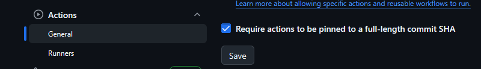
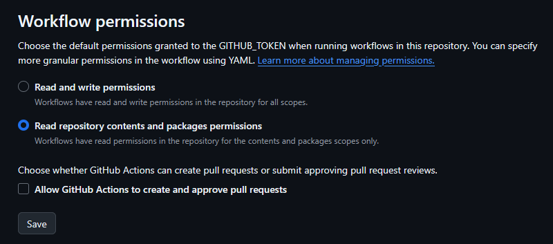

# Security

The DoKa Seca platform implements a defense-in-depth approach to Kubernetes security, leveraging both vulnerability
scanning and runtime threat detection. The 4Cs Security Model: Cloud, Cluster, Container, Code, provides a comprehensive
framework for securing the platform across all layers of the stack.

## Trivy: Vulnerability & Misconfiguration Scanning

[Trivy](https://aquasecurity.github.io/trivy/) is used for:

- Scanning container images for vulnerabilities (CVEs)
- Auditing Kubernetes manifests for misconfigurations
- Integrating with CI/CD pipelines for early detection
- Generating `ConfigAuditReports` and `VulnerabilityReports` in-cluster

**Example: Scan a running deployment**

```bash
kubectl create deployment nginx --image nginx:1.16
kubectl get configauditreports -o wide
```

Sample output:

```sh
NAME                          SCANNER   AGE     CRITICAL   HIGH   MEDIUM   LOW
replicaset-nginx-599c4f6679   Trivy     3m16s   0          2      3        10
```

**Trivy is integrated via the [KubeSec Operator](https://github.com/aquasecurity/trivy-operator) for continuous cluster scanning.**

## Falco: Runtime Threat Detection

[Falco](https://falco.org/) is used for:

- Real-time detection of suspicious activity in Kubernetes nodes and containers
- Alerting on unexpected process execution, file access, privilege escalation, and network activity
- Enforcing runtime security policies with custom rules
- Integrating with alerting systems (Slack, Prometheus, etc)

### Example: View Falco alerts

```bash
kubectl logs -n falco -l app=falco
```

**Common Falco rules include:**

- Detecting shell in a container
- Detecting changes to sensitive files
- Detecting privilege escalation attempts

## Security Best Practices

- All images are scanned before deployment
- Cluster is continuously monitored for runtime threats
- Alerts are integrated with platform observability
- Security events are audited and reviewed regularly

## GitHub Actions Security

### Pin Action Versions

All GitHub Actions used in CI/CD workflows **must use pinned versions (commit SHA)** instead of tags or branches to prevent
supply chain attacks. This ensures immutable references to specific action versions.



**❌ Avoid using tags or branches:**

```yaml
- uses: actions/checkout@v4
- uses: actions/setup-node@main
```

**✅ Use pinned SHA versions:**

```yaml
- uses: actions/checkout@692973e3d937129bcbf40652eb9f2f61becf3332  # v4.1.7
- uses: actions/setup-node@60edb5dd545a775178f52524783378180af0d1f8  # v4.0.2
```

**Benefits of pinning:**

- **Immutability**: Actions cannot be modified after deployment
- **Supply Chain Security**: Prevents compromised tags from affecting workflows
- **Reproducibility**: Ensures consistent behavior across workflow runs
- **Audit Trail**: Clear visibility into exact versions being used

**Implementation Guidelines:**

1. Always include version comment for human readability
2. Regularly update pinned versions and review changes
3. Monitor security advisories for actions in use

**Enforcement with [pinact](https://github.com/suzuki-shunsuke/pinact):**

SHA pinning is enforced using [pinact](https://github.com/suzuki-shunsuke/pinact), a CLI that automatically pins GitHub
Actions and Reusable Workflows to commit SHAs. It can also update pinned versions, verify version annotations, and
skip recently released versions via `--min-age` (acting as a cooldown for actions).

```bash
# Pin all actions in the repository
pinact run

# Validate that all actions are pinned (useful in CI)
pinact run --check

# Update pinned actions to latest versions
pinact run -u

# Update but skip versions released in the last 7 days
pinact run -u --min-age 7
```

### Zizmor Linting

All GitHub Actions workflows **must pass [Zizmor](https://github.com/woodruffw/zizmor) linting rules**.
Zizmor is a static analysis tool that identifies security issues and anti-patterns in GitHub Actions workflows.

**Required checks:**

- No use of untrusted input in dangerous contexts
- Proper secret handling and masking
- Correct permissions configuration (principle of least privilege)
- Safe use of pull request triggers
- Validation of artifact integrity

### Dependabot Cooldowns

To mitigate supply chain attacks from rapid dependency updates, DoKa Seca configures
[Dependabot cooldowns](https://docs.github.com/en/code-security/dependabot/dependabot-version-updates/configuration-options-for-the-dependabot.yml-file#cooldown)
on version update groups. Cooldowns introduce a waiting period before Dependabot opens a pull request for a newly
released version, giving the community time to detect and report compromised packages.

```yaml
version: 2

updates:
  # update once a week, with a 7-day cooldown
  - package-ecosystem: github-actions
    directory: /
    schedule:
      interval: weekly
    cooldown:
      default-days: 7
```

**Why cooldowns matter:**

- **Early-warning buffer**: A 7-day delay allows time for the ecosystem to flag malicious or broken releases before
  they reach your workflows
- **Reduced blast radius**: Prevents automatic adoption of a compromised version minutes after publication
- **Complements SHA pinning**: While pinned SHAs protect against tag mutation, cooldowns protect against net-new malicious releases

### DepsGuard

[DepsGuard](https://depsguard.com/) is used to scan and harden package manager configurations against supply chain
attacks. It provides an interactive TUI that detects missing security settings and applies fixes across npm, pnpm, Yarn,
Bun, and uv.

**What DepsGuard checks and configures:**

- Minimum release age / dependency cooldowns (e.g. `min-release-age` in `.npmrc`, `exclude-newer` in `uv.toml`)
- Disabling risky install scripts (`ignore-scripts=true`)
- Blocking exotic transitive dependencies (`block-exotic-subdeps`)
- Provenance downgrade protection (`trust-policy=no-downgrade`)
- Strict build script enforcement (`strict-dep-builds`)
- Renovate and Dependabot cooldown settings

**Usage:**

```bash
# Install
cargo install depsguard

# Scan current project and show findings
depsguard scan

# Interactive mode: scan, select fixes, preview diffs, and apply
depsguard
```

### Avoid ‘Allow GitHub Actions to Create and Approve Pull Requests’ permission in repository settings and Set Read-Only Default Workflow Permissions



## References

- [Trivy Documentation](https://aquasecurity.github.io/trivy/)
- [Falco Documentation](https://falco.org/docs/)
- [Kubernetes Security Best Practices](https://kubernetes.io/docs/concepts/security/overview/)
- [GitHub Actions Policy](https://github.blog/changelog/2025-08-15-github-actions-policy-now-supports-blocking-and-sha-pinning-actions/)
- [How to Harden GitHub Actions: The Unofficial Guide](https://www.wiz.io/blog/github-actions-security-guide)
- [pinact](https://github.com/suzuki-shunsuke/pinact)
- [Dependabot Cooldowns](https://docs.github.com/en/code-security/dependabot/dependabot-version-updates/configuration-options-for-the-dependabot.yml-file#cooldown)
- [DepsGuard](https://depsguard.com/)
- [Dependency Cooldowns](https://cooldowns.dev/)
