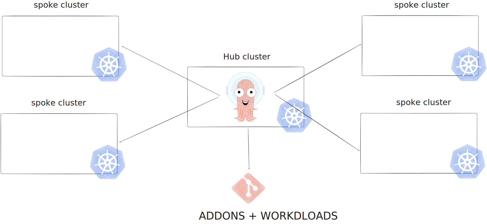
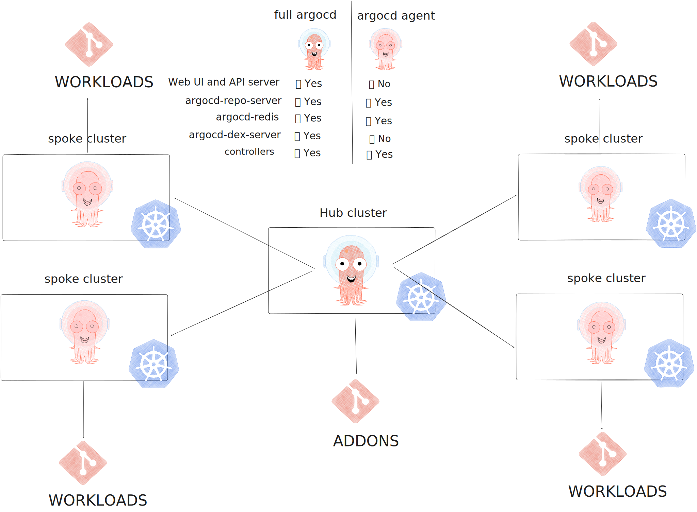

# Multi-Cluster distributed topology

Deploys kind clusters in a multi-cluster setup.

## Standalone/Distributed


Deploys kind clusters in a standalone or distributed manner. Each cluster manages addons and workloads.

```bash
cd distributed
./deploy.sh dev
./deploy.sh stg
./deploy.sh prod
```

## Centralized/Hub-spoke



Deploys kind clusters in a centralized manner, with a hub cluster managing multiple spoke clusters.
The spoke clusters are registered as remote clusters in the Hub Cluster's ArgoCD.
The hub cluster is responsible for managing addons and workloads.

Note: The Hub cluster is deployed first, followed by the Spoke clusters.

```bash
cd hub-spoke/hub
terraform init
terraform apply -auto-approve
```

The Spoke clusters are registered with the Hub's ArgoCD instance.

```bash
cd hub-spoke/spoke
./deploy.sh dev
./deploy.sh stg
./deploy.sh prod
```

Check the ArgoCD UI to verify the Spoke clusters are registered or verify the ArgoCD secrets:

```bash
# change the context to the hub cluster
$ kubectl get secrets -n argocd | grep spoke
spoke-dev                         Opaque               3      6m47s
spoke-stg                         Opaque               3      110s
spoke-prod                        Opaque               3      5m32s
```

Joining spoke clusters to hub.

```bash
$ make argo-cd-ui
Forwarding from 127.0.0.1:8088 -> 8080

$ make argo-cd-login
'admin:login' logged in successfully
Context 'localhost:8088' updated

$ make argo-cd-cluster-list
SERVER                          NAME  VERSION  STATUS      MESSAGE  PROJECT
https://kubernetes.default.svc  hub   1.31     Successful

$ kubectl get secrets -n argocd -l argocd.argoproj.io/secret-type=cluster
NAME        TYPE     DATA   AGE
hub         Opaque   3      11m
spoke-dev   Opaque   3      9m8s
spoke-stg   Opaque   3      5m32s
spoke-prod  Opaque   3      2m15s
```

## Centralized/Hub-spoke (shared)


Deploys kind clusters in a centralized manner, with a hub cluster managing multiple spoke clusters.
The spoke clusters are registered as remote clusters in the Hub Cluster's ArgoCD.
The hub cluster is responsible for managing shared addons, while spoke clusters handle their own specific workloads.

## Centralized/Hub-spoke (shared with CAPI)

Deploys hub kind cluster that creates multiple spoke clusters via Cluster API (CAPI).

```bash
cd hub-spoke-capi
terraform init
terraform apply -auto-approve
```

## Centralized/Hub-spoke (agent)



Deploys kind clusters in a centralized manner, with a hub cluster managing multiple spoke clusters.
The hub cluster is responsible for managing shared addons, while spoke clusters handle their own specific workloads via [argocd agent](https://argocd-agent.readthedocs.io/latest/).

## References

- [gitops-bridge: Multi-Cluster EKS Example](https://github.com/gitops-bridge-dev/gitops-bridge/tree/main/argocd/iac/terraform/examples/eks/multi-cluster)
- [Amazon EKS Multi-Cluster GitOps](https://www.slideshare.net/slideshow/amazon-eks-multicluster-gitopsbridgepdf/263198295)
