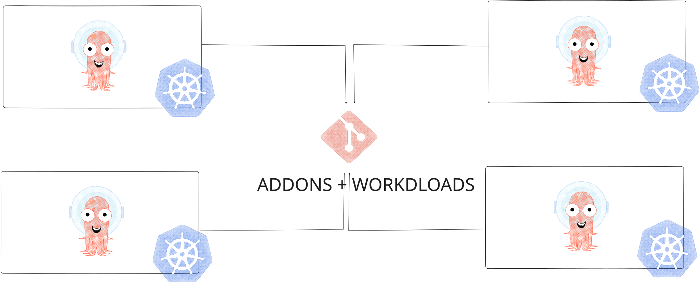
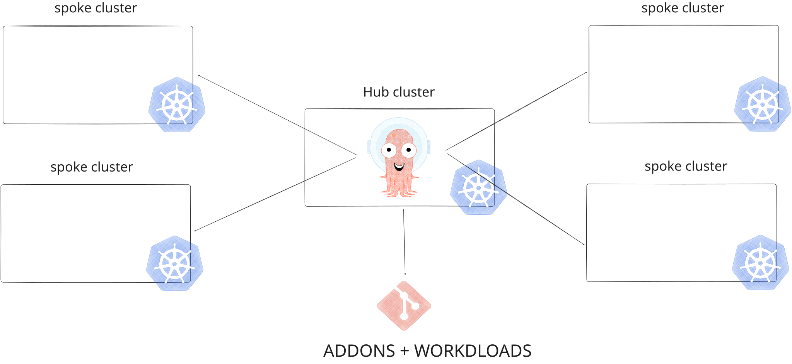
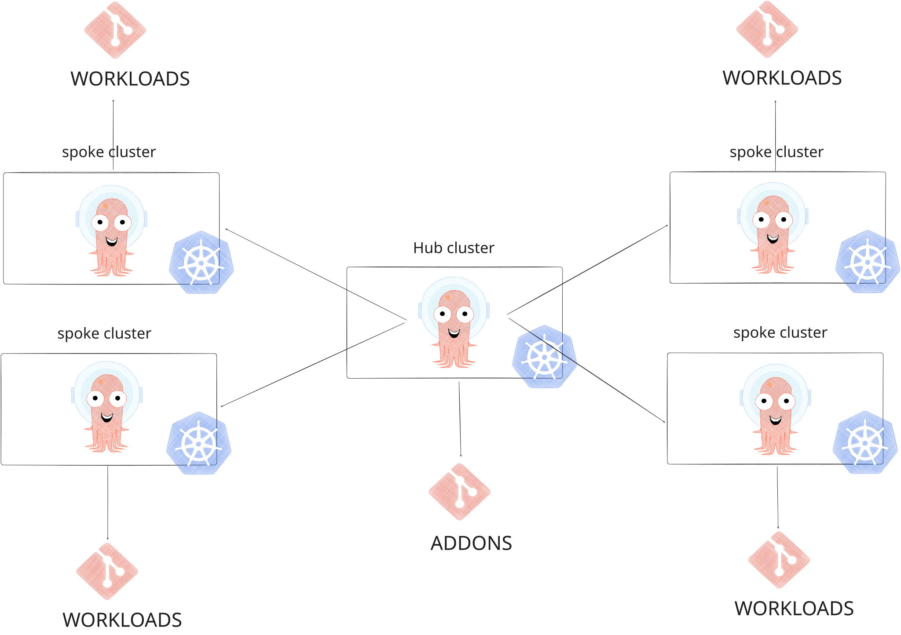
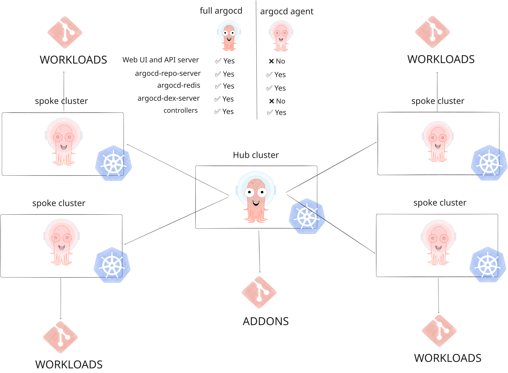

# Multi-Cluster distributed topology

Deploys kind clusters in a multi-cluster setup.

```sh
$ tree terraform/topologies
terraform/topologies
├── distributed
│   ├── bootstrap
│   │   ├── addons.yaml
│   │   └── workloads.yaml
│   ├── deploy.sh
│   ├── locals.tf
│   ├── main.tf
│   ├── outputs.tf
│   ├── providers.tf
│   ├── variables.tf
│   └── workspaces
│       ├── dev.tfvars
│       ├── prod.tfvars
│       └── stg.tfvars
├── hub-spoke
│   ├── hub
│   │   ├── bootstrap
│   │   │   ├── addons.yaml
│   │   │   └── workloads.yaml
│   │   ├── locals.tf
│   │   ├── main.tf
│   │   ├── outputs.tf
│   │   ├── providers.tf
│   │   ├── terraform.tfstate
│   │   └── variables.tf
│   └── spokes
│       ├── deploy.sh
│       ├── locals.tf
│       ├── main.tf
│       ├── outputs.tf
│       ├── providers.tf
│       ├── terraform.tfstate.d
│       │   └── dev
│       ├── variables.tf
│       └── workspaces
│           ├── dev.tfvars
│           ├── prod.tfvars
│           └── stg.tfvars
├── hub-spoke-agent
│   ├── hub
│   │   ├── bootstrap
│   │   │   ├── addons.yaml
│   │   │   └── workloads.yaml
│   │   ├── locals.tf
│   │   ├── main.tf
│   │   ├── outputs.tf
│   │   ├── providers.tf
│   │   └── variables.tf
│   └── spokes
│       ├── bootstrap
│       │   └── workloads.yaml
│       ├── deploy.sh
│       ├── locals.tf
│       ├── main.tf
│       ├── outputs.tf
│       ├── providers.tf
│       ├── variables.tf
│       └── workspaces
│           ├── dev.tfvars
│           ├── prod.tfvars
│           └── stg.tfvars
├── hub-spoke-capi
│   ├── bootstrap
│   │   ├── addons.yaml
│   │   ├── clusters.yaml
│   │   └── workloads.yaml
│   ├── locals.tf
│   ├── main.tf
│   ├── outputs.tf
│   ├── providers.tf
│   └── variables.tf
├── hub-spoke-shared
│   ├── hub
│   │   ├── bootstrap
│   │   │   ├── addons.yaml
│   │   │   └── workloads.yaml
│   │   ├── locals.tf
│   │   ├── main.tf
│   │   ├── outputs.tf
│   │   ├── providers.tf
│   │   ├── terraform.tfstate
│   │   ├── terraform.tfstate.backup
│   │   └── variables.tf
│   └── spokes
│       ├── bootstrap
│       │   └── workloads.yaml
│       ├── deploy.sh
│       ├── locals.tf
│       ├── main.tf
│       ├── outputs.tf
│       ├── providers.tf
│       ├── terraform.tfstate.d
│       │   └── dev
│       │       └── terraform.tfstate
│       ├── variables.tf
│       └── workspaces
│           ├── dev.tfvars
│           ├── prod.tfvars
│           └── stg.tfvars
└── standalone
    ├── bootstrap
    │   ├── addons.yaml
    │   └── workloads.yaml
    ├── deploy.sh
    ├── locals.tf
    ├── main.tf
    ├── outputs.tf
    ├── providers.tf
    ├── terraform.tfvars
    └── variables.tf
```

## Standalone/Distributed



Deploys kind clusters in a standalone or distributed manner. Each cluster manages addons and workloads.

```bash
cd topologies/distributed
./deploy.sh dev
./deploy.sh stg
./deploy.sh prod
```

## Centralized/Hub-spoke



Deploys kind clusters in a centralized manner, with a hub cluster managing multiple spoke clusters.
The spoke clusters are registered as remote clusters in the Hub Cluster's ArgoCD.
The hub cluster is responsible for managing addons and workloads.

Note: The Hub cluster is deployed first, followed by the Spoke clusters.

```bash
cd topologies/hub-spoke/hub
terraform init
terraform apply -auto-approve
```

The Spoke clusters are registered with the Hub's ArgoCD instance.

```bash
cd topologies/hub-spoke/spoke
./deploy.sh dev
./deploy.sh stg
./deploy.sh prod
```

Check the ArgoCD UI to verify the Spoke clusters are registered or verify the ArgoCD secrets:

```bash
# change the context to the hub cluster
$ kubectl get secrets -n argocd -l argocd.argoproj.io/secret-type=cluster
NAME        TYPE     DATA   AGE
hub         Opaque   3      11m
spoke-dev   Opaque   3      9m8s
spoke-stg   Opaque   3      5m32s
spoke-prod  Opaque   3      2m15s
```

## Centralized/Hub-spoke (shared)



Deploys kind clusters in a centralized manner, with a hub cluster managing multiple spoke clusters.
The spoke clusters are registered as remote clusters in the Hub Cluster's ArgoCD.
The hub cluster is responsible for managing shared addons, while spoke clusters handle their own specific workloads.

## Centralized/Hub-spoke (shared with CAPI)

Deploys hub kind cluster that creates multiple spoke clusters via Cluster API (CAPI).

```bash
cd topologies/hub-spoke-capi
terraform init
terraform apply -auto-approve
```

## Centralized/Hub-spoke (agent)



Deploys kind clusters in a centralized manner, with a hub cluster managing multiple spoke clusters.
The hub cluster is responsible for managing shared addons, while spoke clusters handle their own specific workloads via [argocd agent](https://argocd-agent.readthedocs.io/latest/).

## References

- [gitops-bridge: Multi-Cluster EKS Example](https://github.com/gitops-bridge-dev/gitops-bridge/tree/main/argocd/iac/terraform/examples/eks/multi-cluster)
- [Amazon EKS Multi-Cluster GitOps](https://www.slideshare.net/slideshow/amazon-eks-multicluster-gitopsbridgepdf/263198295)
